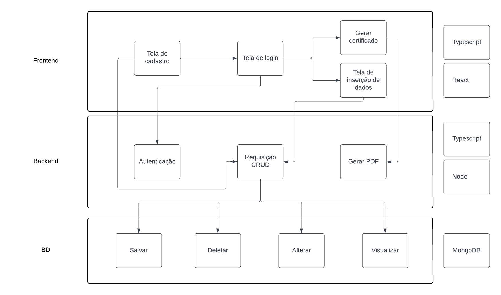

# Projeto de Oficina de Integração 2

## Descrição
Este projeto foi criado para a disciplina de Oficina de Integração 2. 
Nosso objetivo consiste em criar uma plataforma capaz de auxiliar no cadastro e criação de certificados para os alunos participantes do ELLP.

## Requisitos funcionais e estratégia de automação de testes do sistema
A descrição detalhada dos Requisitos Funcionais levatados e da estratégia de automação de testes para o sistema podem ser acessados no seguinte [arquivo](docs/Req_func_e_Testes.pdf).

## Diagrama de arquitetura de alto nível do sistema

## Tecnologias Utilizadas
### Front-end
- React com TypeScript.
### Back-end
- Node com Express e TypeScript.
### Testes do sistema
- Jest.
### Modelagem do Sistema
- Figma.
### Ferramentas de Gerenciamento
- Trello e Discord.
### Banco de Dados
- MongoDB.

## Funcionalidades
### Autenticação de Usuários
- Login obrigatório para acessar a plataforma.
### Gerar Certificados
- Será criado um PDF contendo o certificado dos alunos do programa.
### Inserção dinâmica de dados
- A plataforma deve ser capaz de receber dados de forma simples e direta.

## Autores
- [@Gabriela Rocha Passotto](https://github.com/Gabi-passotto)
- [@Gustavo Bueno de Carvalho](https://github.com/gustavo-bueno)
- [@Marcos Vinícius Bueno Prestes](https://github.com/BuenoMVP)